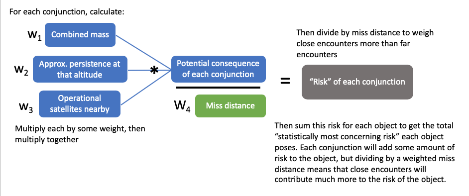

```{r include=F}
knitr::opts_chunk$set(echo=F)
knitr::opts_chunk$set(warning=F)
knitr::opts_chunk$set(message=F)

library(tidyverse)
library(kableExtra)
library(knitr)
library(DT)
library(RColorBrewer)
mcma_objs = readRDS("RDSfiles/mcma_objs")
all_conjs = readRDS("RDSfiles/all_conjs")
all_conjs_expanded = readRDS("RDSfiles/all_conjs_expanded")
today="30NOV2019"
```

## Miss distance vs cumulative count plot
```{r}
# axis ticks for log scale
ticks <- 1:10
ooms <- 10^(0:3) # define orders of magnitudes
breaks <- as.vector(ticks %o% ooms)

show.labels <- c(T, F, F, F, T, F, T, F, F)
labels <- as.character(breaks * show.labels)
labels <- gsub("^0$", "", labels)

all_conjs %>%
  group_by(clusterLab) %>%
  arrange(Range) %>%
  mutate(rowid = 1, cumnum = cumsum(rowid)) %>% 
  ggplot(aes(x=Range, y = cumnum, color=clusterLab)) + 
  geom_line() +
  theme_light() +
  scale_x_log10(labels = labels, breaks = breaks) +
  scale_y_log10(labels = labels, breaks = breaks) +
  labs(x="Miss Distance (km)", y="Cumulative Number of Encounters", color="Cluster",
       title="Cumulative Number of Encounters by Cluster", subtitle = paste0("Encounters from 20OCT2019-", today))+
  scale_color_brewer(palette="Set1")
```


## Percent of Encounters by Country

```{r fig.width=7.5}
# read in country codes
country_codes = read_csv("./country_codes.csv", 
                         col_names = c("country", "Country"), col_types = "cc", skip = 1) %>%
  mutate(Country = str_to_title(Country),
         Country = if_else(str_length(Country) > 20, country, Country))

# plot percent of encounters by country
p = all_conjs %>%
  mutate(noradId = as.numeric(gsub("--.*$", "", PrimarySatellite ))) %>%
  left_join(dplyr::select(mcma_objs, c(noradId, country)), by="noradId") %>%
  mutate(country = if_else(country == "CHBZ", "PRC", country)) %>%
  group_by(clusterLab, country) %>% 
  summarise(numEncounters = n()) %>%
  left_join(country_codes, by="country") %>% 
  group_by(clusterLab) %>%
  mutate(encountersPerClust = sum(numEncounters), 
         p = numEncounters / encountersPerClust * 100) %>%
  group_by(clusterLab) %>%
  mutate(country_new = if_else(p < 2, "Other", Country)) %>% 
  mutate(p = if_else(country_new=="Other", mean(p[country_new=="Other"]), p))

colourCount = length(unique(p$country_new))
getPalette = colorRampPalette(brewer.pal(9, "Set1"))

ggplot() + 
  geom_bar(data = p, aes(x=clusterLab, y=p/100, group=country_new, fill=country_new), stat="identity")+
  geom_text(data = unique(dplyr::select(p, c(clusterLab, encountersPerClust))), position = position_stack(vjust=1.05), 
            aes(x=clusterLab, y=1, label=encountersPerClust))+
  theme_minimal() +
  scale_y_continuous(labels = scales::percent) + 
  scale_fill_manual(values = getPalette(colourCount))+
  labs(x="Cluster",y="", title = "Percent of Encounters by Country", fill="Country",
       subtitle="Number of encounters shown above each bar", caption=paste0("Encounters from 20OCT2019-", today))
```


## Worst offender analysis-- Method 1

Using the below algorithm (with all weights equal to 1 for now-- will experiment with later): 

```{r }
top50 = mcma_objs %>% 
  arrange(desc(totalRisk)) %>%
  head(50)

top50 = all_conjs_expanded %>%
  filter(noradId %in% top50$noradId) %>%
  group_by(noradId) %>%
  summarise(numConjs = n(),
            `closestApproach(m)` = min(Range)*1000,
            avgNumOpSats = mean(numOpSats),
            medianNumOpSats = median(numOpSats),
            `avgPersistenceOfConjAlt(yrs)` = mean(persistence),
            `medianPersistenceOfConjAlt(yrs)` = median(persistence),
            numEncountersBelow1km = length(Range[Range<1])) %>% 
  right_join(top50, by="noradId")
```

Current list of top 50 objects with highest risk:
```{r }
top50 %>% dplyr::select(c("noradId", "totalRisk", "numConjs","closestApproach(m)",
                          "avgNumOpSats","medianNumOpSats",
                          "avgPersistenceOfConjAlt(yrs)",
                          "medianPersistenceOfConjAlt(yrs)", "numEncountersBelow1km","apogee", "perigee",
                          "cluster_new","launch","inclination","mass","type","country")) %>%
  DT::datatable(rownames=F, 
                options = list(
                  #columnDefs = list(list(className = 'dt-center', targets = 4)),
                  lengthMenu = c(10, 20, 30, 40, 50) )
                ) %>%
  formatRound(columns = c("closestApproach(m)","avgNumOpSats","medianNumOpSats",
  "avgPersistenceOfConjAlt(yrs)","medianPersistenceOfConjAlt(yrs)", "totalRisk"), digits=1) %>%
  formatDate(columns = "launch", method = "toLocaleDateString")
```

- `numConjs` is the total number of conjunctions (<5km) the object has been in (since 20OCT2019)
- `avgNumOpSats` is the average number of operational satellites within 100 km above or below each conjunction
- `medianNumOpSats` is the same as `avgNumOpSats` but median instead of mean
- `avgPersistenceOfConjAlt` is the average persistence of debris produced at the altitude of encounters (a rough approximation based on altitude)
- `medianPersistenceOfConjAlt` is the same as `avgPersistenceOfConjAlt` but median instead of mean
- `numEncountersBelow1km` is the number of encounters below 1 km miss distance

### Risk among all objects
Among all objects, percent of risk accounted for by each cluster

```{r}
mcma_objs %>% group_by(cluster_new) %>%
  summarise(p = n()) %>% 
  mutate(p = p/nrow(mcma_objs)*100,
         cluster_new = factor(cluster_new,
                             levels = c("cc615", "cc775", "cc850", "cc975", "cc1200", "cc1500", "cleo","CHIGH"),
                             ordered = T))%>%
  ggplot(aes(x=1, y=p, fill=cluster_new)) +
  geom_col(width = .5)+
  geom_text(position = position_stack(vjust=.5), 
            aes(label=paste0(round(p), "%")))+
  theme_minimal()+
  theme(axis.title.x = element_blank(), axis.text = element_blank(), 
        panel.grid.major = element_blank(), panel.grid.minor = element_blank())+
  labs(fill="Cluster", y="Risk")
```

## Worst offender analysis-- Method 2 (Darren's method)