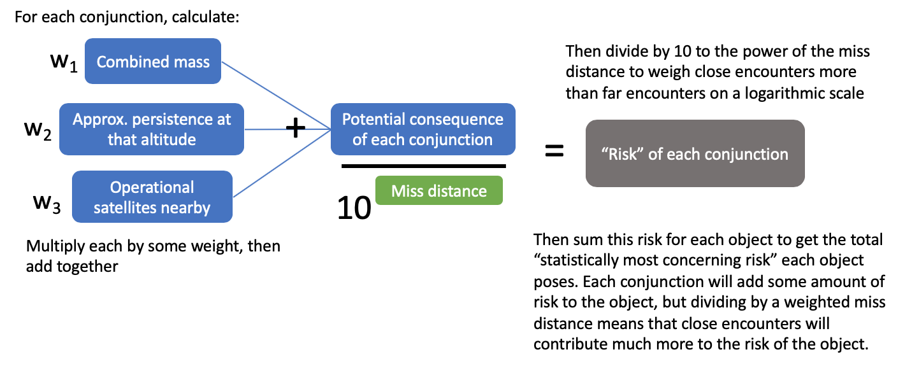

```{r include=F}
knitr::opts_chunk$set(echo=F)
knitr::opts_chunk$set(warning=F)
knitr::opts_chunk$set(message=F)

setwd("~/Documents/Centauri/fall part time/conjunction_analysis/")
library(tidyverse)
library(readr)
library(kableExtra)
library(knitr)
library(lubridate)
library(DT)
library(RColorBrewer)
library(stringr)
library(scales)
Sys.setenv(TZ='EST')
mcma_objs = readRDS("RDSfiles/mcma_objs")
all_conjs = readRDS("RDSfiles/all_conjs")
all_conjs_expanded = readRDS("RDSfiles/all_conjs_expanded")
derelicts = readRDS("RDSfiles/derelicts")
derelictDat = readRDS("RDSfiles/derelictDatNew")
alt_bins = readRDS("RDSfiles/alt_bins")
file_list = readRDS("RDSfiles/file_list")
today = toupper(strftime(Sys.Date(), format="%d%b%Y")) # current day
path = "conj_data/"
```

```{r update_conj_files, eval=F}
# add new conjunction files to all_conjs dataframe

# read in new conjunction files
file_list_new = list.files(path)
file_list_new = file_list_new[!(file_list_new %in% file_list)] # only the new conjunctions

colnames = c("PrimarySatellite","SecondarySatellite","TCA_EpDay",
             "TCA_UTCG","Range","RangeX","RangeY","RangeZ","Velocity",
             "VelocityX","VelocityY","VelocityZ","Latitude","Longitude",
             "Altitude","PrimaryAge","SecondaryAge","PrimaryCluster",
             "SecondaryCluster","DateGenerated","del")

all_conjs_new = data.frame()
for (i in 1:length(file_list_new)) {
  file = paste0(path, file_list_new[i])
  #print(file)
  
  firstLine = readLines(file, n=2)[2]
  
  if (str_count(firstLine, ',') == 20) { # if file has trailing commas
    temp_data = read_csv(file, skip=1, col_names = colnames, 
                         col_types = "ccncnnnnnnnnnnncccccc") %>%
      select(-del)
  } else {
    temp_data = read_csv(file, skip=1, 
                         col_names = colnames[-length(colnames)], 
                         col_types = "ccncnnnnnnnnnnnccccc")
  }
  
  all_conjs_new = rbind(all_conjs_new, temp_data) #for each iteration, bind the new data to the building dataset
}

mycols <- '(PrimaryCluster, SecondaryCluster)'
minf <- paste0('min',mycols)
maxf <- paste0('max',mycols)

all_conjs_new = all_conjs_new %>%
  mutate(DateGenerated = parse_date_time(DateGenerated, tz="EST", 
                                   orders=c("%Y-%m-%d %H:%M:%S", "%m/%d/%y %H:%M")),
         date = DateGenerated - 24*60*60,
         utcg = if_else(nchar(TCA_UTCG) > 7,
                        as.POSIXct(TCA_UTCG, format="%Y-%m-%d %H:%M:%S"),
                        date + TCA_EpDay*24*60*60),
         TCA_UTCG = utcg) %>% 
  select(-c(date, utcg)) %>%
  rowwise() %>% 
  mutate(firstClust = eval(parse(text=minf)),
         secondClust = eval(parse(text=maxf)),
         clusters = paste(firstClust, secondClust, sep="-")) %>% 
  ungroup() %>%
  mutate(clusterLab = if_else(firstClust=="LEO" & secondClust=="LEO", "LEO",
                              if_else((firstClust=="LEO" & secondClust!="LEO") |
                                        (firstClust!="LEO" & secondClust=="LEO"), "LEO-other",
                                      if_else(firstClust=="HIGH" & secondClust=="HIGH", "HIGH",
                                              if_else((firstClust=="HIGH" & secondClust!="HIGH") | 
                                                        (firstClust!="HIGH" & secondClust=="HIGH"), "HIGH-other",
                                                      firstClust)))),
         clusterLab = factor(clusterLab,
                             levels = c("615", "775", "850", "975", "1200", "1500", "LEO","LEO-other","HIGH","HIGH-other"),
                             ordered = T))

# update file list
file_list = append(file_list, file_list_new)
saveRDS(file_list, "RDSfiles/file_list")

#########
# WORST OFFENDER alg for new conjunctions
# persistence
alts = c(775,850,975,1500)
pers = c(300,500,1800,20000)
persistence = cbind(alts, pers) %>% as_tibble()
model = lm(log(pers) ~ alts, persistence)
intercept = as.numeric(model$coefficients[1])
slope = as.numeric(model$coefficients[2])

# get operational satellites
opSats = derelictDat %>% filter(avgAlt < 2000 & operational)

combinedMass_v = vector()
persistence_v = vector()
numOpSats_v = vector()
for (i in 1:nrow(all_conjs_new)) {
  conj = all_conjs_new[i, ]
  noradId1 = gsub("--.*", "", conj$PrimarySatellite)
  noradId2 = gsub("--.*", "", conj$SecondarySatellite)
  obj1 = filter(mcma_objs, noradId == noradId1)
  obj2 = filter(mcma_objs, noradId == noradId2)
  
  combinedMass = as.numeric(obj1$mass) + as.numeric(obj2$mass)
  persistence = exp(intercept + slope * conj$Altitude)
  
  numOpSats = 0
  for (j in 1:nrow(opSats)) {
    # count how many op sats overlap in altitude
    opSat = opSats[j,]
    conjMinAlt = conj$Altitude - 100
    conjMaxAlt = conj$Altitude + 100
    if ((opSat$perigee > conjMinAlt &
         opSat$apogee < conjMaxAlt) ||
        (opSat$perigee < conjMaxAlt &
         opSat$apogee > conjMaxAlt) ||
        (opSat$perigee < conjMinAlt &
         opSat$apogee > conjMinAlt)) {
      numOpSats = numOpSats + 1
    }
  }
  
  combinedMass_v = append(combinedMass_v, toString(combinedMass))
  persistence_v = append(persistence_v, persistence)
  numOpSats_v = append(numOpSats_v, numOpSats)
}
all_conjs_new$combinedMass = combinedMass_v
all_conjs_new$persistence = persistence_v
all_conjs_new$numOpSats = numOpSats_v

all_conjs_new = all_conjs_new %>%
  mutate(combinedMass = if_else(grepl(",", combinedMass, fixed = T), # if it contains a comma
                                 as.numeric(gsub(",.*", "", combinedMass)), # make substring up to the comma
                                 as.numeric(combinedMass) )) #%>% # otherwise don't change
  #mutate(risk = (combinedMass + persistence + numOpSats) / (Range))

all_conjs_new = all_conjs_new %>%
  mutate(risk = (combinedMass + persistence + numOpSats) / Range,
         combinedMass_s = rescale(combinedMass, to=c(1e-4,100)),
         persistence_s = rescale(persistence, to=c(1e-4,100)),
         numOpSats_s = rescale(numOpSats, to=c(1e-4,50)),
         Range_s = rescale(Range, to=c(1e-4, 100)),
         risk_s = (combinedMass_s + persistence_s + numOpSats_s) / (Range_s)) #%>%
  #arrange(desc(risk_s)) %>% View()


# append new conjunctions to previous
all_conjs = rbind(all_conjs, all_conjs_new)
saveRDS(all_conjs, "RDSfiles/all_conjs") # save to RDS file

# adjust scaling
all_conjs = all_conjs %>%
  mutate(risk = (combinedMass + persistence + numOpSats) / Range,
         combinedMass_s = rescale(combinedMass, to=c(0,100)),
         persistence_s = rescale(persistence, to=c(0,100)),
         numOpSats_s = rescale(numOpSats, to=c(0,100)),
         Range_s = 10^(Range), #rescale(Range, to=c(1e-4, 100)),
         risk_s = (combinedMass_s + persistence_s + numOpSats_s) / (Range_s)) #%>%

# all_conjs = all_conjs %>% 
#   mutate(clusterLab = if_else(firstClust=="LEO" & secondClust=="LEO", "LEO",
#                               if_else((firstClust=="LEO" & secondClust!="LEO") |
#                                         (firstClust!="LEO" & secondClust=="LEO"), "LEO-other",
#                                       if_else(firstClust=="HIGH" & secondClust=="HIGH", "HIGH",
#                                               if_else((firstClust=="HIGH" & secondClust!="HIGH") | 
#                                                         (firstClust!="HIGH" & secondClust=="HIGH"), "HIGH-other",
#                                                       firstClust)))),
#          clusterLab = factor(clusterLab,
#                              levels = c("615", "775", "850", "975", "1200", "1500", "LEO","LEO-other","HIGH","HIGH-other"),
#                              ordered = T))

# we need some kind of exponential scale for range where a 50m miss is 100x more risky
# than a 500m miss...

# sum risk for each object:
# list all conjunctions by first sat, then by second sat, then bind by rows
firstSet = all_conjs %>%
  mutate(noradId = as.numeric(gsub("--.*", "", PrimarySatellite))) %>%
  dplyr::select(-c(PrimarySatellite, SecondarySatellite))

secondSet = all_conjs %>%
  mutate(noradId = as.numeric(gsub("--.*", "", SecondarySatellite))) %>%
  dplyr::select(-c(PrimarySatellite, SecondarySatellite))

# append new conjunctions to previous
all_conjs_expanded = rbind(firstSet, secondSet)
saveRDS(all_conjs_expanded, "RDSfiles/all_conjs_expanded") # save to RDS file
```

## Miss distance vs cumulative count plot
```{r miss_dist_cum_count_plot}
# axis ticks for log scale
#ticks <- 1:10
#ooms <- 10^(0:3) # define orders of magnitudes
#breaks <- as.vector(ticks %o% ooms)
#breaks = c(1,2,3,4,5,6,7,8,9,10,20,30,40,
#           50,60,708,090,100,200,300,400,500,600,700,800,
#           900,1000,2000,3000,4000,5000,6000,7000,8000,9000,10000)

#show.labels <- c(T, F, F, T, F, F, T, F)
#labels <- as.character(breaks * show.labels)
#labels <- gsub("^0$", "", labels)

mycolors = c(brewer.pal(name="Set1", n = 9), brewer.pal(name="Set2", n = 4))
mycolors[6] = "#000000"

all_conjs %>%
  mutate(Range = Range * 1000) %>%
  group_by(clusterLab) %>%
  arrange(Range) %>%
  mutate(rowid = 1, cumnum = cumsum(rowid)) %>% 
  rename(Cluster = clusterLab) %>%
  ggplot(aes(x=Range, y = cumnum, color=Cluster, linetype=Cluster)) + 
  geom_line() +
  theme_light() +
  scale_x_log10(labels = c(10,100,300,500,1000,5000), 
                breaks = c(10,100,300,500,1000, 5000)) +
  scale_y_log10(labels = c(10,100,300,500,1000,3000,5000), 
                breaks = c(10,100,300,500,1000,3000,5000)) +
  labs(x="Miss Distance (m)", y="Cumulative Number of Encounters", #color="Cluster",
       title="Cumulative Number of Encounters by Cluster", 
       subtitle = paste0("Encounters from 20OCT2019-", today))+
  #scale_color_brewer(palette="Set1")+
  scale_color_manual(values = mycolors)+
  #scale_y_log10(breaks = scales::trans_breaks("log10", function(x) 10^x),
  #              labels = scales::trans_format("log10", scales::math_format(10^.x)))+
  #scale_x_log10(breaks = scales::trans_breaks("log10", function(x) 10^x),
  #              labels = scales::trans_format("log10", scales::math_format(10^.x)))+
  annotation_logticks()+
  scale_linetype_manual(values=c("dashed", "solid", "solid", "solid",
                                 "solid", "solid", "solid", "solid", "solid", "dashed"))
```

## Percent of Encounters by Country

```{r perc_encounters_country, fig.width=7.5}
# read in country codes
country_codes = read_csv("./misc_files/country_codes.csv", 
                         col_names = c("country", "Country"), col_types = "cc", skip = 1) %>%
  mutate(Country = str_to_title(Country),
         Country = if_else(str_length(Country) > 20, country, Country))

# plot percent of encounters by country
p = all_conjs_expanded %>%
  left_join(dplyr::select(mcma_objs, c(noradId, country)), by="noradId") %>%
  mutate(country = if_else(country == "CHBZ", "PRC", country),
         country = replace_na(country, "Other")) %>% 
  group_by(clusterLab, country) %>% 
  summarise(numEncounters = n()) %>% 
  left_join(country_codes, by="country") %>% 
  group_by(clusterLab) %>%
  mutate(encountersPerClust = sum(numEncounters), 
         p = numEncounters / encountersPerClust * 100) %>%
  group_by(clusterLab) %>%
  mutate(country_new = if_else(Country %in% c("CIS", "US", "China", "ESA", "France", "Germany", "India", "Japan"), Country, "Other")) %>% 
  group_by(clusterLab, country_new) %>%
  summarise(p = sum(p),
            encountersPerClust = round(min(encountersPerClust)/2)) %>%
  mutate(country_new = factor(country_new, 
                              levels = c("CIS", "US", "China", "ESA", "France", 
                                         "Germany", "India", "Japan", "Other"), 
                              ordered=T))

ggplot() + 
  geom_bar(data = p, aes(x=clusterLab, y=p/100, group=country_new, fill=country_new), stat="identity")+
  geom_text(data = unique(dplyr::select(p, c(clusterLab, encountersPerClust))), position = position_stack(vjust=1.05), 
            aes(x=clusterLab, y=1, label=encountersPerClust))+
  theme_minimal() +
  scale_y_continuous(labels = scales::percent) + 
  scale_fill_brewer(palette = "Set1")+
  labs(x="Cluster",y="", title = "Percent of Encounters by Country - misses within 5 km", fill="Country",
       subtitle="Number of encounters shown above each bar", caption=paste0("Encounters from 20OCT2019-", today))
```

```{r barchart500m, fig.width=7.5}
p = all_conjs_expanded %>%
  filter(Range <= 0.5) %>%
  left_join(dplyr::select(mcma_objs, c(noradId, country)), by="noradId") %>%
  mutate(country = if_else(country == "CHBZ", "PRC", country),
         country = replace_na(country, "Other")) %>% 
  group_by(clusterLab, country) %>% 
  summarise(numEncounters = n()) %>% 
  left_join(country_codes, by="country") %>% 
  group_by(clusterLab) %>%
  mutate(encountersPerClust = sum(numEncounters), 
         p = numEncounters / encountersPerClust * 100) %>%
  group_by(clusterLab) %>%
  mutate(country_new = if_else(Country %in% c("CIS", "US", "China", "ESA", "France", "Germany", "India", "Japan"), Country, "Other")) %>% 
  group_by(clusterLab, country_new) %>%
  summarise(p = sum(p),
            encountersPerClust = round(min(encountersPerClust)/2)) %>%
  mutate(country_new = factor(country_new, 
                              levels = c("CIS", "US", "China", "ESA", "France", 
                                         "Germany", "India", "Japan", "Other"), 
                              ordered=T))

ggplot() + 
  geom_bar(data = p, aes(x=clusterLab, y=p/100, group=country_new, fill=country_new), stat="identity")+
  geom_text(data = unique(dplyr::select(p, c(clusterLab, encountersPerClust))), position = position_stack(vjust=1.05), 
            aes(x=clusterLab, y=1, label=encountersPerClust))+
  theme_minimal() +
  scale_y_continuous(labels = scales::percent) + 
  scale_fill_brewer(palette = "Set1")+
  labs(x="Cluster",y="", title = "Percent of Encounters by Country - misses within 500 m", fill="Country",
       subtitle="Number of encounters shown above each bar", caption=paste0("Encounters from 20OCT2019-", today))
```


## Worst offender analysis-- Method 1

Using the below algorithm (with all weights equal to 1 for now-- will experiment with later): 

```{r top50}
mcma_objs = all_conjs_expanded %>%
  group_by(noradId) %>% 
  #summarise(totalRisk = sum(risk)) %>%
  summarise(totalRisk = sum(risk_s)) %>%
  right_join(select(mcma_objs, -totalRisk), by="noradId") %>% 
  mutate(totalRisk = if_else(is.na(totalRisk), 0, totalRisk))

#saveRDS(mcma_objs, "RDSfiles/mcma_objs") # save to RDS file

top50 = mcma_objs %>% 
  arrange(desc(totalRisk)) %>%
  head(50)

top50 = all_conjs_expanded %>%
  filter(noradId %in% top50$noradId) %>%
  group_by(noradId) %>%
  summarise(`num conjs` = n(),
            `closest approach (m)` = min(Range)*1000,
            `avg num op sats` = mean(numOpSats),
            `med num op sats` = median(numOpSats),
            `avg persist of conj alt` = mean(persistence),
            `med persist of conj alt` = median(persistence),
            `num encounters <1 km` = length(Range[Range<1])) %>% 
  right_join(top50, by="noradId")
```

Current list of top 50 objects with highest risk:
```{r view_top_50}
cols_ordered = c("noradId", "cluster_new", "totalRisk", "num conjs", "closest approach (m)", "avg num op sats","med num op sats", "avg persist of conj alt", "med persist of conj alt", "num encounters <1 km", "apogee", "perigee","launch","inclination","mass","type","country")

top50 %>% dplyr::select(cols_ordered) %>%
  rename(cluster=cluster_new,
         `total risk`=totalRisk) %>%
  DT::datatable(rownames=F, extensions = c('Buttons', 'Responsive'),
                options = list( lengthMenu = c(10, 20, 30, 40, 50),
                                buttons = list(list(extend='excel',filename="worst_offenders_1", text="Download data", title=paste0("Worst offenders (method 1) as of ", today))),
                                dom = 'Bfrtip'#,
                                )) %>%
  formatRound(columns = c("closest approach (m)","avg num op sats","med num op sats",
  "avg persist of conj alt","med persist of conj alt", "total risk"), digits=1) %>%
  formatDate(columns = "launch", method = "toDateString", params = list('en-US', list(year = 'numeric', month = 'numeric', day='numeric')
      ))

```

- `num conjs` is the total number of conjunctions (<5km) the object has been in (since 20OCT2019)
- `avg num op sats` is the average number of operational satellites within 100 km above or below each conjunction
- `med num op sats` is the same as `avg num op sats` but median instead of mean
- `avg persist of conj alt` is the average persistence (in years) of debris produced at the altitude of encounters (a rough approximation based on altitude)
- `med persist of conj alt` is the same as `avg persist of conj alt` but median instead of mean
- `num encounters <1 km` is the number of encounters below 1 km miss distance

### Risk among all derelicts
Among all derelicts, percent of risk accounted for by each cluster:

```{r risk_plot, fig.width=4}
totRisk = mcma_objs %>% summarise(totRisk = sum(totalRisk)) %>% pull()

mcma_objs %>% group_by(cluster_new) %>%
  summarise(p = sum(totalRisk)) %>% 
  mutate(p = p/totRisk*100,
         cluster_new = factor(cluster_new,
                             levels = c("cc615", "cc775", "cc850", "cc975", "cc1200", "cc1500", "cleo","CHIGH"),
                             ordered = T))%>%
  ggplot(aes(x=1, y=p, fill=cluster_new)) +
  geom_col(width = .2)+
  geom_text(position = position_stack(vjust=0.5), 
            aes(label=paste0(round(p), "%")))+
  theme_minimal()+
  theme(axis.title.x = element_blank(), axis.text = element_blank(), 
        panel.grid.major = element_blank(), panel.grid.minor = element_blank())+
  labs(fill="Cluster", y="Risk")+
  scale_fill_brewer(type = "qual")
```

## Worst offender analysis-- Method 2

The second method for calculating the top 50 statistically most concerning objects also uses the idea that risk = probability * consequence, although it slightly differs from the first method in what components make up probability and consequence.

Probability:

- CR = annual collision rate of each cluster
  * Each cluster of massive derelicts has an annual collision rate
- AR = cross-sectional area of object (estimated by multiplying mass by 0.005)
  * The larger cross-sectional area, the larger the likelihood of colliding
- E5 = number of encounters < 5 km per year
- E1 = number of encounters < 1 km per year

Consequence:

- MF = $\frac{mass~of~object}{1500}$
  * Mass is proportional to the amount of debris produced (mass ranges from 700-9000 kg)
  * Divide by 1500 so that objects below 1500 kg bring risk down while larger masses increase risk
- DF = $\frac{atmospheric~density ~at~ 500~km}{atmospheric~density~at ~object's ~avg. ~altitude}$ 
  * There's a higher consequence for debris that linger for a longer amount of time, and orbital lifetime of resulting debris is proportional to atmospheric density (which decreases exponentially with increasing altitude).
  * Averaged across each cluster
- SD = spatial density of operational satellites
  * Consequence is higher when there are more operational satellites in the vacinity
  * Averaged across each cluster

Then for each object, the risk is calculated as:
$$Risk = [CR * AR * {E5/25 * (5 * E1)}] * [MF * DF * SD]$$
```{r numOpSatsVec, eval=F}
## OLD -- DONT USE
# numOpSatsVec contains number of op sats that cross paths with each object's path
numOpSatsVec = vector()
for (i in 1:nrow(mcma_objs)){
  row = mcma_objs[i,]
  minAlt = row$perigee
  maxAlt = row$apogee
  numOpSats = 0
  for (j in 1:nrow(opSats)){
    opSat = opSats[j,]
    if ((opSat$perigee > minAlt & opSat$apogee < maxAlt) ||
      (opSat$perigee < maxAlt & opSat$apogee > maxAlt) ||
      (opSat$perigee < minAlt & opSat$apogee > minAlt)) {
    numOpSats = numOpSats + 1
    }
  }
  numOpSatsVec = append(numOpSatsVec, numOpSats)
}

mcma_objs$numOpSats = numOpSatsVec
```

```{r getSpaDens, eval=F}
# For the spatial density calculation, I'm creating a dataframe with altitude (intervals of 10) and volume; then counting the number of massive derelicts (based on their avg altitude) within each bin; then interpolating a spatial density value for each object's avg altitude.
opSats = derelictDat %>% filter(operational & onOrbit)

library(pracma)
integrand = function(r,phi,theta) {(r^2)*sin(phi)}
radius = 6371 #Earth's radius

get_volume = function(minalt, maxalt) {
  integral3(integrand, radius+minalt, radius+maxalt, 0, pi, 0, 2*pi)
}

alt_bins = data.frame(altitude = seq(110, 70000, 10))
vols = sapply(alt_bins$altitude, function(x) {get_volume(x, x+10)})
alt_bins$volume = vols

saveRDS(alt_bins, "RDSfiles/alt_bins")

roundDown <- function(x) 10*floor(x/10)
library(zoo)

alt_bins = readRDS("RDSfiles/alt_bins")

alt_bins = opSats %>%
  mutate(altitude = roundDown((as.numeric(apogee) + as.numeric(perigee))/2)) %>% 
  group_by(altitude) %>% 
  summarise(numOpSats = n()) %>% 
  right_join(alt_bins, by="altitude") %>%
  mutate(numOpSats = replace_na(numOpSats, 0)) %>% 
  mutate(spatDensOpSats_1 = numOpSats / volume * (10^10)) %>%
  mutate(spatDensOpSats = rollmean(spatDensOpSats_1, k=5, na.pad=T))

mcma_objs = mcma_objs %>% 
  mutate(altitude = roundDown((as.numeric(apogee) + as.numeric(perigee))/2)) %>% 
  left_join(select(alt_bins, c(altitude, spatDensOpSats)), by="altitude") 

saveRDS(mcma_objs, "RDSfiles/mcma_objs")
```

```{r getDF, eval=F}
df_data = readxl::read_xlsx("misc_files/DF.xlsx", skip = 2, 
                            col_names = c("altitude","atmos_dens", "DF_old", "DF"))

# fit exponential model to DF data
model = lm(log(atmos_dens) ~ altitude, df_data)
intercept = as.numeric(model$coefficients[1])
slope = as.numeric(model$coefficients[2])

altvalues <- seq(0, 1600, 50)
predicted_atmos_dens <- exp(predict(model,list(altitude=altvalues)))
plot(df_data$altitude, df_data$atmos_dens,pch=16)
lines(altvalues, predicted_atmos_dens,lwd=2, col = "red")


ad_at_500 = 9e-13

df_data$predicted_dens = exp(intercept + slope * df_data$altitude)
df_data$predicted_df = ad_at_500 / df_data$predicted_dens

roundDown <- function(x) 25*floor(x/25)

mcma_objs = mcma_objs %>% 
  mutate(avgAlt = (as.numeric(apogee)+as.numeric(perigee))/2,
    predicted_ad = exp(intercept + slope * avgAlt),
    DF = predicted_ad / ad_at_500)

saveRDS(mcma_objs, "RDSfiles/mcma_objs")
```

Summary of key measures per cluster:

```{r getCR}
library(pracma)
integrand = function(r,phi,theta) {(r^2)*sin(phi)}
radius = 6371 #Earth's radius

get_volume = function(minalt, maxalt) {
  integral3(integrand, radius+minalt, radius+maxalt, 0, pi, 0, 2*pi)
}

# SD of cluster
x = c("cc615","cc775","cc850","cc975","cc1200","cc1500","cleo","CHIGH")

cluster_summary = mcma_objs %>% 
  group_by(cluster_new) %>%
  summarise(numDerelicts = n(),
            avgMass = mean(as.numeric(mass), na.rm=T)) %>%
  slice(match(x, cluster_new))

cluster_summary$volume = c(get_volume(475,659),
                      get_volume(666,810),
                      get_volume(810,896),
                      get_volume(900,1020),
                      get_volume(1021,1319),
                      get_volume(1352,1600),
                      get_volume(477,1589),
                      get_volume(112,69991))

#cluster_summary$SD = cluster_summary$numSats / cluster_summary$volume * (10^10)

cluster_summary = all_conjs_expanded %>% 
  left_join(select(mcma_objs, c(noradId, cluster_new)), by="noradId") %>%
  group_by(cluster_new) %>%
  summarise(velocity = mean(Velocity)) %>%
  slice(match(x, cluster_new)) %>%
  right_join(cluster_summary, by="cluster_new") %>%
  mutate(diam_m = .005*avgMass,
         AC = (pi*(diam_m/1000)^2)/4,
         lambda = (numDerelicts / volume) * AC * velocity,
         Time = 12*60*60*24*30, # seconds in a year
         PC = 1 - exp(-lambda * Time),
         CR = PC * numDerelicts/2) %>%
  select(-Time)
         #CR = numSats^2/2 * (AC * velocity * Time) / volume) # collision rate

# updated values from spreadsheet 2/6/20
cluster_summary$CR = c(1.5E-03, 1.4E-03, 2.4E-03, 8.2E-03, 3.3E-05, 1.2E-04, 3.1E-04, 2.5E-07)
#cluster_summary$AR = c(9,8,16,6,7,7,9,15)
cluster_summary$DF = c(25,90,150,1000,1200,1600,150,100) # why use these numbers?
#cluster_summary$SD = c(2.7, 2.5, 1.8, 1.2, 1.4, 1.7, 2.0, 0.5) #log(SD)
cluster_summary$SD = c(538,346,69,17,26,56,103,3)


cluster_summary %>% 
  mutate(AC = format(AC, scientific = T, digits=2),
         volume = format(volume, scientific = T, digits=2),
         lambda = format(lambda, scientific = T, digits=2),
         PC = format(PC, scientific = T, digits=2),
         CR = format(CR, scientific = T, digits=2)) %>%
  rename(cluster = cluster_new,
         `num derelicts` = numDerelicts,
         `avg mass (kg)` = avgMass,
         `avg diam` = diam_m) %>%
  select(-velocity) %>%
  kable(digits = 1, format.args = list(big.mark = ",")) %>%
  kableExtra::kable_styling()
```


Top 50 statistically most concerning objects:

```{r getSMC}
cols_ordered = c("noradId", "name","cluster_new","SMC_risk", "E5", "E1", "spatDens", "DF", "AR", "MF","spatDensOpSats","AC","CR",
                 "apogee", "perigee","launch","inclination","mass","type","country")

SMC_out = all_conjs_expanded %>% 
  group_by(noradId) %>%
  summarise(E5 = length(Range),
            E1 = length(Range[Range <= 1])) %>%
  right_join(mcma_objs, by="noradId") %>% 
  dplyr::select(-DF) %>% # DF for object's altitude
  mutate(E5 = replace_na(E5, 0),
         E1 = replace_na(E1, 0),
         AR = .005 * as.numeric(mass), 
         MF = as.numeric(mass)/1500) %>%
  left_join(cluster_summary, by="cluster_new") %>% 
  mutate(SMC_risk = (CR * AR * E5/25 * 5 * E1) * (MF * DF * spatDensOpSats)) %>%
  arrange(desc(SMC_risk)) %>%
  dplyr::select(cols_ordered) 

SMC_out %>%
  head(50) %>% 
  mutate(AC = format(AC, scientific = T, digits=2),
         CR = format(CR, scientific = T, digits=2)) %>%
  rename(cluster=cluster_new) %>%
  DT::datatable(rownames=F, extensions = c('Buttons', 'Responsive'),
                options = list( lengthMenu = c(10, 20, 30, 40, 50),
                                buttons = list(list(extend='excel',filename="worst_offenders_2", text="Download data", title=paste0("Worst offenders (method 2) as of ", today))),
                                dom = 'Bfrtip'#,
                                )) %>%
  formatRound(columns = c("SMC_risk","spatDens","DF","spatDensOpSats","AC","CR", "MF"), digits=2) %>%
  formatDate(columns = "launch", method = "toDateString", params = list('en-US', list(year = 'numeric', month = 'numeric', day='numeric')
      ))

```

```{r SMC_out_cluster_summary, eval=F}
SMC_out %>% group_by(cluster_new) %>% 
  summarise(avgCR = format(mean(CR), scientific = T, digits=2),
            avgAR = round(mean(AR),2),
            avgE5 = round(mean(E5),2),
            avgE1 = round(mean(E1),2),
            avgMF = round(mean(MF),2),
            avgDF = format(mean(DF),scientific = T, digits=2), 
            avgSD = round(mean(spatDensOpSats),2)) %>%
  slice(match(x, cluster_new)) %>% View()
```

### Risk among all derelicts
Among all derelicts, percent of risk accounted for by each cluster:

```{r risk_plot_2, fig.width=4}
totRisk = SMC_out %>% summarise(totRisk = sum(SMC_risk)) %>% pull()

SMC_out %>% #head(50) %>%
  group_by(cluster_new) %>%
  #summarise(p = n()) %>% 
  summarise(p = sum(SMC_risk)) %>% 
  mutate(p = p/totRisk*100,
         cluster_new = factor(cluster_new, levels = c("cc615", "cc775", "cc850", "cc975", "cc1200", "cc1500", "cleo","CHIGH"), ordered = T)) %>% 
  ggplot(aes(x=1, y=p, fill=cluster_new)) +
  geom_col(width = .2)+
  geom_text(position = position_stack(vjust=0.5), 
            aes(label=paste0(round(p), "%")))+
  theme_minimal()+
  theme(axis.title.x = element_blank(), axis.text = element_blank(), 
        panel.grid.major = element_blank(), panel.grid.minor = element_blank())+
  labs(fill="Cluster", y="Risk")+
  scale_fill_brewer(type = "qual")
```

